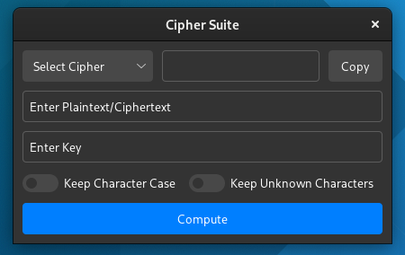
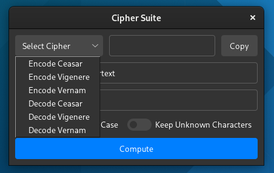

# Password-Generator
This is an application that supports the encoding and decoding of three popular ciphers:
- [Ceasar Cipher](https://en.wikipedia.org/wiki/Caesar_cipher)
- [Vigenere Cipher](https://en.wikipedia.org/wiki/Vigen%C3%A8re_cipher)
- [Vernam Cipher](https://en.wikipedia.org/wiki/Gilbert_Vernam)

This was made for a small college project - its very simple. For the UI it uses Tkinter with my custom theme [Williams-Theme](https://github.com/unavailable-name/Williams-Theme "Williams-Theme"). All the code is in one file, however it wouldn't be difficult to refactor it and have seperate files for each cipher.

# Program Screenshot:

# Usage
## Ceasar Cipher and Vigenere Cipher Options:
- Keep Character Case: Keeps the character case in the output. When the setting is on: `Test -> Docd` and when the setting is off: `Test -> docd`.
- Keep Unknown Characters: Any Characters that don't work in the cipher (most puncutation, etc) gets put in the ciphertext at the same position. For example, when the setting is on: `test! -> docd!` and when setting is off: `test! -> docd`.

## Vernam Cipher Options:
 - Keep Character Case: Same as Ceasar Cipher and Vigenere Cipher
 - Seperate Binary: Splits up output binary string into 8-bit blocks. When the setting is on: `test -> 00000100000100110000010100000100` and when setting is off: `test -> 00000100 00010011 00000101 00000100`.

## Encoding/Decoding
To encode with a particular cipher do the following steps:
- Select a Cipher via the Entry that says `Select Cipher` - Make sure you choose an option that says encode if you want to encode or decode if you want to decode.
- Enter the text you wish to encode/decode into the input that says `Enter Plaintext/Ciphertext`.
- Enter a key into the input that says `Enter Key` - Becareful here, some ciphers only allow certain types of keys. For example, a Ceasar Cipher will only work with an integer.
- Click Compute and the output will be displayed in the output window.
